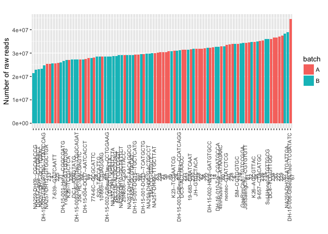
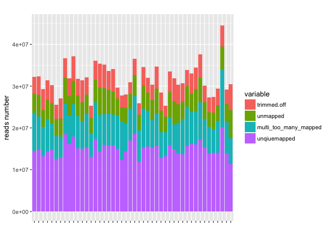
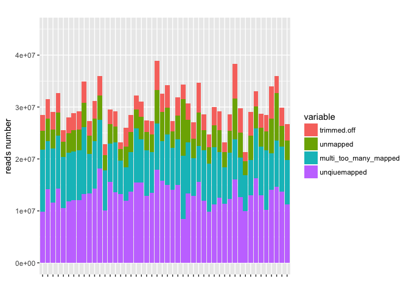
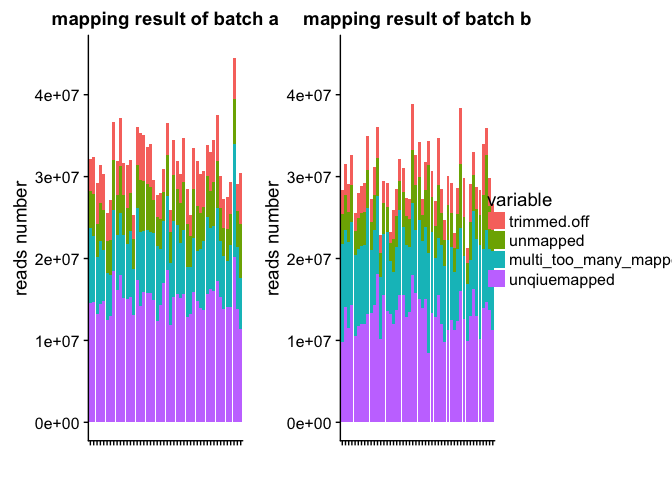
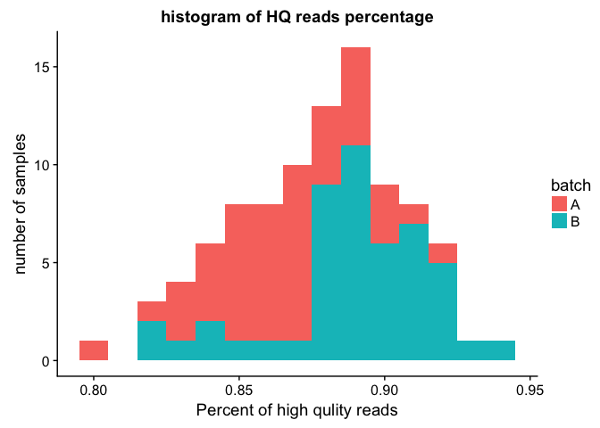
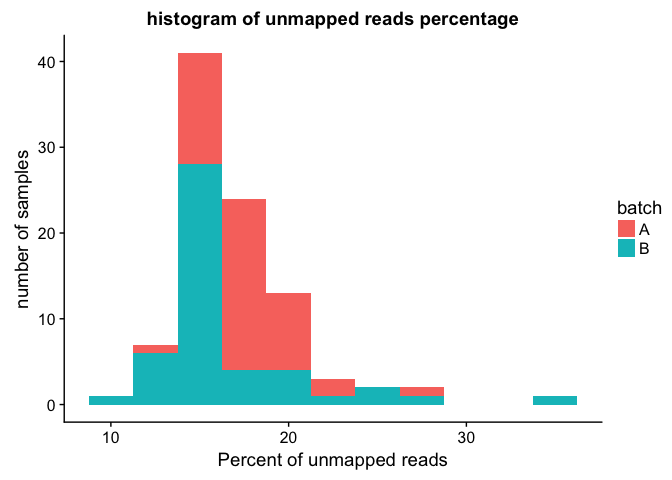
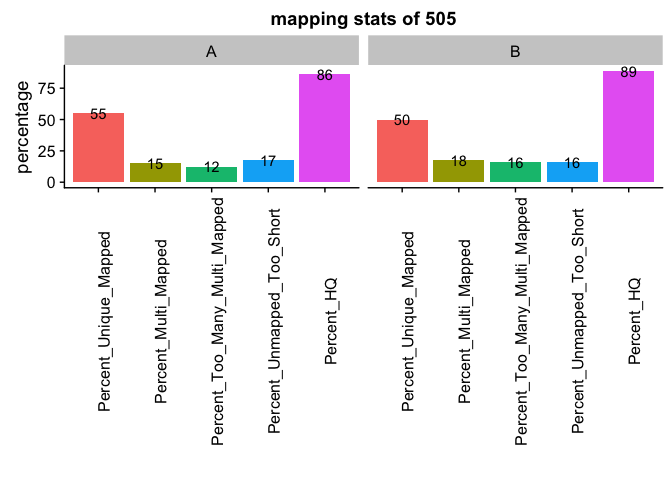

# 505
Ruijuan Li  
2/8/2017  

# download, trimming, mapping 

```r
# 1) download 
# in cabernet, using download.slurm & download_2.slurm
# also download to whitney 

# 2) trimming on whitney only 
# trimming.sh

# 3) check quality, doing 
# before trimming, QC was done by company, so look at the result directly using /Network/Servers/avalanche.plb.ucdavis.edu/Volumes/Mammoth/Users/ruijuanli/2017_winter/505/data/bioftp.org/TBD170026_20170202/make_summary_report.sh  
# after trimming, fastqc by QC.sh, then check quality 

# 4) transfer all trimmed data to cabernet for mapping 
# get file name: ls | grep "Sample" | sed 's/\///' | tr '\n' ' '
# /share/malooflab/Ruijuan/505/trimmed_data/TBD170026_20170202/fetch_02_13_2017.slurm & 
# /share/malooflab/Ruijuan/505/trimmed_data/TBD170001_1617/fetch_02_13_2017_2.slurm 

# 5) mapping, one sample takes about 15-20 Mins on 12 CPUs 
# /Network/Servers/avalanche.plb.ucdavis.edu/Volumes/Mammoth/Users/ruijuanli/2017_winter/505/data/bioftp.org/TBD170026_20170202/mapping_505.sh 

# 6) extract start result using 
# /Network/Servers/avalanche.plb.ucdavis.edu/Volumes/Mammoth/Users/ruijuanli/2017_winter/505/data/bioftp.org/TBD170026_20170202/star_extract_stats.sh  
```

# mapping result analysis 

```r
source("/Users/ruijuanli/Desktop/Brassica_project/KIAT_RNA_seq/analysis/function_BnRNAseq.R")
```

```
## Loading required package: BiocGenerics
```

```
## Loading required package: parallel
```

```
## 
## Attaching package: 'BiocGenerics'
```

```
## The following objects are masked from 'package:parallel':
## 
##     clusterApply, clusterApplyLB, clusterCall, clusterEvalQ,
##     clusterExport, clusterMap, parApply, parCapply, parLapply,
##     parLapplyLB, parRapply, parSapply, parSapplyLB
```

```
## The following objects are masked from 'package:stats':
## 
##     IQR, mad, xtabs
```

```
## The following objects are masked from 'package:base':
## 
##     anyDuplicated, append, as.data.frame, as.vector, cbind,
##     colnames, do.call, duplicated, eval, evalq, Filter, Find, get,
##     grep, grepl, intersect, is.unsorted, lapply, lengths, Map,
##     mapply, match, mget, order, paste, pmax, pmax.int, pmin,
##     pmin.int, Position, rank, rbind, Reduce, rownames, sapply,
##     setdiff, sort, table, tapply, union, unique, unlist, unsplit
```

```
## Loading required package: BiocParallel
```

```
## Loading required package: Biostrings
```

```
## Loading required package: S4Vectors
```

```
## Loading required package: stats4
```

```
## Loading required package: IRanges
```

```
## Loading required package: XVector
```

```
## Loading required package: Rsamtools
```

```
## Loading required package: GenomeInfoDb
```

```
## Loading required package: GenomicRanges
```

```
## Loading required package: GenomicAlignments
```

```
## Loading required package: SummarizedExperiment
```

```
## Loading required package: Biobase
```

```
## Welcome to Bioconductor
## 
##     Vignettes contain introductory material; view with
##     'browseVignettes()'. To cite Bioconductor, see
##     'citation("Biobase")', and for packages 'citation("pkgname")'.
```

```
## Loading required package: BiasedUrn
```

```
## Loading required package: geneLenDataBase
```

```
## Loading required package: DBI
```

```
## Warning: package 'DBI' was built under R version 3.2.5
```

```
## 
```

```
## Loading required package: AnnotationDbi
```

```
## Loading required package: XML
```

```
## Loading required package: dynamicTreeCut
```

```
## Loading required package: fastcluster
```

```
## 
## Attaching package: 'fastcluster'
```

```
## The following object is masked from 'package:stats':
## 
##     hclust
```

```
## 
## Attaching package: 'WGCNA'
```

```
## The following object is masked from 'package:IRanges':
## 
##     cor
```

```
## The following object is masked from 'package:stats':
## 
##     cor
```

```
## Warning: package 'ggplot2' was built under R version 3.2.5
```

```
## Warning: package 'reshape2' was built under R version 3.2.5
```

```
## Warning: package 'scales' was built under R version 3.2.5
```

```
## Warning: package 'plyr' was built under R version 3.2.5
```

```
## 
## Attaching package: 'plyr'
```

```
## The following object is masked from 'package:ShortRead':
## 
##     id
```

```
## The following object is masked from 'package:XVector':
## 
##     compact
```

```
## The following object is masked from 'package:IRanges':
## 
##     desc
```

```
## The following object is masked from 'package:S4Vectors':
## 
##     rename
```

```r
# sample description 
sample_des_a <- read.csv("~/Desktop/Brassica_project/KIAT_RNA_seq/505/Sequencing_Statistics_Result_TBD170001_1617.csv", header = T)
sample_des_a$batch <- rep("A", nrow(sample_des_a))
sample_des_a_sub <- sample_des_a[,c("Sample.ID","TotalReads","batch")]
sample_des_b <- read.csv("~/Desktop/Brassica_project/KIAT_RNA_seq/505/Sequencing_Statistics_Result_TBD170026.csv", header = T)
sample_des_b$batch <- rep("B", nrow(sample_des_b))
sample_des_b_sub <- sample_des_b[,c("Sample.ID","TotalReads","batch")]
head(sample_des_a_sub)

# mapping result
mapping_result <- read.table("~/Desktop/Brassica_project/KIAT_RNA_seq/505/Star_Stats.tab", header = T)
head(mapping_result)
mapping_result$Sample.ID <- gsub("(Sample_)([[:print:]])", "\\2", mapping_result$Sample) 

# merge sample description & mapping result for batch A and batch B 
batch.a.stats <- merge(sample_des_a_sub, mapping_result, by="Sample.ID")
batch.b.stats <- merge(sample_des_b_sub, mapping_result, by="Sample.ID")
mapping_result_505 <- rbind(batch.a.stats, batch.b.stats)

mapping_result_505$batch
mapping_result_505$Number_Input_Reads/(mapping_result_505$TotalReads/2)

# number of total reads 
library(ggplot2)
p.total.reads <- ggplot(data=mapping_result_505)
p.total.reads <- p.total.reads + geom_bar(aes(x=reorder(Sample.ID, TotalReads/2), y=TotalReads/2, fill=batch), stat = "identity")
p.total.reads <- p.total.reads + labs(list(title = "", x = "", y = "Number of raw reads"))
p.total.reads <- p.total.reads + theme(axis.text.x = element_text(angle = 90, size = 8)) 
p.total.reads   
```

<!-- -->

```r
# ggsave(p.total.reads, filename = "~/Desktop/Brassica_project/KIAT_RNA_seq/505/figure/total_reads.png", height = 8, width = 11) 

# look at HQ, mapped, multimapped in detail for each sample (memory too low, cannot view histogram of total reads...)
colnames(mapping_result_505)
mapping_result_505_sub <- data.frame(Sample.ID = mapping_result_505$Sample.ID, 
                                     batch=mapping_result_505$batch,
                                    trimmed.off = mapping_result_505$TotalReads/2 - mapping_result_505$Number_Input_Reads,
                                    unmapped = mapping_result_505$Number_Input_Reads * (as.numeric(mapping_result_505$Percent_Unmapped_Mismatches + mapping_result_505$Percent_Unmapped_Other + mapping_result_505$Percent_Unmapped_Too_Short)/100), 
                                    multi_too_many_mapped = mapping_result_505$Number_Multi_Mapped + mapping_result_505$Number_Too_Many_Multi_Mapped, 
                                    unqiuemapped = mapping_result_505$Number_Unique_Mapped
) 

mapping_result_505_sub 

mapping_result_505_sub.long <- melt(mapping_result_505_sub, id.vars = c("Sample.ID", "batch"))
mapping_result_505_sub.long.a <- mapping_result_505_sub.long[mapping_result_505_sub.long$batch=="A",]
mapping_result_505_sub.long.b <- mapping_result_505_sub.long[mapping_result_505_sub.long$batch=="B",]

pl.mapping.indi.a <- ggplot(data = mapping_result_505_sub.long.a)
pl.mapping.indi.a <- pl.mapping.indi.a + geom_bar(aes(x=Sample.ID, y = value, fill=variable), stat = "identity")
pl.mapping.indi.a <- pl.mapping.indi.a + labs(list(title = "", x = " ", y = "reads number")) + theme(axis.text.x=element_blank()) + ylim(0, 4.5e+7) 
pl.mapping.indi.a
```

<!-- -->

```r
pl.mapping.indi.b <- ggplot(data = mapping_result_505_sub.long.b)
pl.mapping.indi.b <- pl.mapping.indi.b + geom_bar(aes(x=Sample.ID, y = value, fill=variable), stat = "identity")
pl.mapping.indi.b <- pl.mapping.indi.b + labs(list(title = "", x = " ", y = "reads number")) + theme(axis.text.x=element_blank()) + ylim(0, 4.5e+7)
pl.mapping.indi.b
```

<!-- -->

```r
library(cowplot)
```

```
## Warning: package 'cowplot' was built under R version 3.2.5
```

```
## Warning: `legend.margin` must be specified using `margin()`. For the old
## behavior use legend.spacing
```

```
## 
## Attaching package: 'cowplot'
```

```
## The following object is masked from 'package:ggplot2':
## 
##     ggsave
```

```r
pl.mapping.indi <- plot_grid(
  pl.mapping.indi.a +labs(title="mapping result of batch a")+theme(legend.position = "none"),
  pl.mapping.indi.b +labs(title="mapping result of batch b") +theme(legend.position = "none"),
  align = 'vh', ncol=2, nrow = 1, labels=c("",""))
```

```
## Warning: `panel.margin` is deprecated. Please use `panel.spacing` property
## instead
```

```r
get_legend<-function(a.gplot){
  tmp <- ggplot_gtable(ggplot_build(a.gplot))
  leg <- which(sapply(tmp$grobs, function(x) x$name) == "guide-box")
  legend <- tmp$grobs[[leg]]
  return(legend)}

legend <- get_legend(pl.mapping.indi.a)

# pl.mapping.indi <- plot_grid(arrangeGrob(pl.mapping.indi.a + theme(legend.position="none") + labs(title="mapping result of batch a"),
#                          pl.mapping.indi.b + theme(legend.position="none") + labs(title="mapping result of batch b"),
#                          nrow=1),
#              legend, nrow=2,heights=c(10, 1))

pl.mapping.indi.final <- plot_grid(pl.mapping.indi, legend, rel_widths = c(3, 1))
```

```
## Warning: `panel.margin` is deprecated. Please use `panel.spacing` property
## instead
```

```r
pl.mapping.indi.final
```

<!-- -->

```r
# save_plot("~/Desktop/Brassica_project/KIAT_RNA_seq/505/figure/pl_mapping_indi.png", pl.mapping.indi.final, base_aspect_ratio = 1, base_width = 12)  


# look at histogram of HQ reads 
colnames(mapping_result_505)
p.HQ.perc <- ggplot(data=mapping_result_505)
p.HQ.perc <- p.HQ.perc + geom_histogram(aes(x=mapping_result_505$Number_Input_Reads/(mapping_result_505$TotalReads/2), fill=batch), binwidth = 0.01) 
p.HQ.perc <- p.HQ.perc + labs(list(title = "histogram of HQ reads percentage", x = "Percent of high qulity reads", y = "number of samples"))
p.HQ.perc  
```

<!-- -->

```r
# ggsave(p.uniq.mapping, filename = "~/Desktop/Brassica_project/KIAT_RNA_seq/505/HQ_hist.png", height = 8, width = 11) 

# histogram of unqiue mapped reads 
p.uniq.mapping <- ggplot(data=mapping_result_505)
p.uniq.mapping <- p.uniq.mapping + geom_histogram(aes(x=Percent_Unique_Mapped, fill=batch), binwidth = 2.5) 
p.uniq.mapping <- p.uniq.mapping + labs(list(title = "histogram of uniquely mapped reads percentage", x = "Percent of uniquely mapped reads", y = "number of samples"))
p.uniq.mapping  
```

<!-- -->

```r
# ggsave(p.uniq.mapping, filename = "~/Desktop/Brassica_project/KIAT_RNA_seq/505/unique_mapped.png", height = 8, width = 11) 

# hisogram of multimapped & too many reads 
p.multi.too.many.mapping <- ggplot(data=mapping_result_505)
p.multi.too.many.mapping <- p.multi.too.many.mapping + geom_histogram(aes(x=mapping_result_505$Percent_Multi_Mapped+mapping_result_505$Percent_Too_Many_Multi_Mapped, fill=batch), binwidth = 2.5) 
p.multi.too.many.mapping <- p.multi.too.many.mapping + labs(list(title = "", x = "Percent of multi & too many mapped reads", y = "number of samples"))

# histogram of multi mapped 
p.multi.mapping <- ggplot(data=mapping_result_505)
p.multi.mapping <- p.multi.mapping + geom_histogram(aes(x=mapping_result_505$Percent_Multi_Mapped, fill=batch), binwidth = 2.5) 
p.multi.mapping <- p.multi.mapping + labs(list(title = "histogram of multi mapped reads percentage", x = "Percent of multi mapped reads", y = "number of samples"))
p.multi.mapping
```

<!-- -->

```r
# ggsave(p.multi.mapping, filename = "~/Desktop/Brassica_project/KIAT_RNA_seq/505/multi_mapped.png", height = 8, width = 11) 

# histogram of too many mapped 
p.toomany.mapping <- ggplot(data=mapping_result_505)
p.toomany.mapping <- p.toomany.mapping + geom_histogram(aes(x=mapping_result_505$Percent_Too_Many_Multi_Mapped, fill=batch), binwidth = 2.5) 
p.toomany.mapping <- p.toomany.mapping + labs(list(title = "histogram of too many mapped reads percentage", x = "Percent of toomany mapped reads", y = "number of samples"))
p.toomany.mapping
```

<!-- -->

```r
# ggsave(p.toomany.mapping, filename = "~/Desktop/Brassica_project/KIAT_RNA_seq/505/toomany_mapped.png", height = 8, width = 11) 

# histogram of unmapped 
p.un.mapping <- ggplot(data=mapping_result_505)
p.un.mapping <- p.un.mapping + geom_histogram(aes(x=mapping_result_505$Percent_Unmapped_Mismatches+mapping_result_505$Percent_Unmapped_Other+mapping_result_505$Percent_Unmapped_Too_Short, fill=batch), binwidth = 2.5) 
p.un.mapping <- p.un.mapping + labs(list(title = "histogram of unmapped reads percentage", x = "Percent of unmapped reads", y = "number of samples"))
p.un.mapping
```

<!-- -->

```r
# ggsave(p.un.mapping, filename = "~/Desktop/Brassica_project/KIAT_RNA_seq/505/un_mapped.png", height = 8, width = 11)

# mapping stats 
colnames(mapping_result_505)
# average percentage of HQ, unique, multi, toomany, unmapped 
average.mapping <- aggregate(mapping_result_505[,c("TotalReads","Number_Input_Reads", "Percent_Unique_Mapped", "Percent_Multi_Mapped", "Percent_Too_Many_Multi_Mapped", "Percent_Unmapped_Too_Short")], list(mapping_result_505$batch), mean)

rownames(average.mapping) <- average.mapping$Group.1
average.mapping$Percent_HQ <- average.mapping$Number_Input_Reads/(average.mapping$TotalReads/2)*100
average.mapping

average.mapping.long <- melt(average.mapping[,c("Percent_Unique_Mapped", "Percent_Multi_Mapped", "Percent_Too_Many_Multi_Mapped", "Percent_Unmapped_Too_Short","Percent_HQ","Group.1")], id.vars = "Group.1")

average.mapping.long

p.average.mapping <- ggplot(data = average.mapping.long)
p.average.mapping <- p.average.mapping + geom_bar(aes(x=variable, y=value, fill=variable), stat = "identity")
p.average.mapping <- p.average.mapping + facet_wrap(~Group.1, ncol = 2)
p.average.mapping <- p.average.mapping + labs(list(title = "mapping stats of 505", x = "", y = "percentage"))
p.average.mapping <- p.average.mapping + theme(axis.text.x = element_text(angle = 90), legend.position = "none")
p.average.mapping <- p.average.mapping + geom_text(data = average.mapping.long, aes(x=variable, y=value, label=factor(round(value,0)))) 
p.average.mapping
```

<!-- -->

```r
# ggsave(p.average.mapping, filename =  "~/Desktop/Brassica_project/KIAT_RNA_seq/505/figure/average_mapping.png", height = 7, width = 12) 
```


